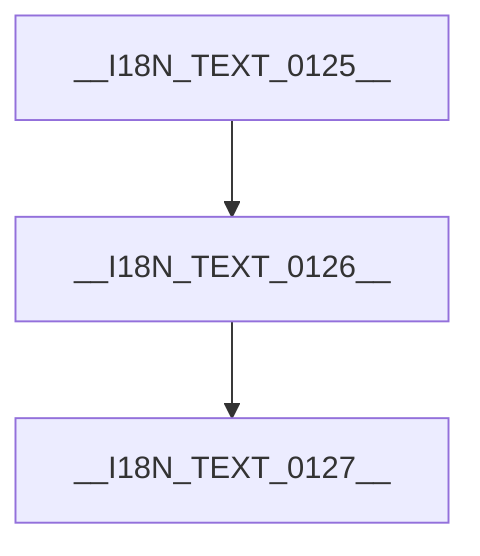

---
metadata:
  name: genernal-template
  description: __I18N_TEXT_0034__ WebApp Shell __I18N_TEXT_0035__,__I18N_TEXT_0036__ dashboard,command center,interactive tool surface __I18N_TEXT_0037__.
  page_id: ""
---

# __I18N_TEXT_0038__(__I18N_TEXT_0039__)

- __I18N_TEXT_0040__:`<page-name>`
- __I18N_TEXT_0041__:__I18N_TEXT_0042__ `<topic>` __I18N_TEXT_0043__ WebApp __I18N_TEXT_0044__
- __I18N_TEXT_0045__:`<audience>`
- __I18N_TEXT_0046__:`<scenario>`
- __I18N_TEXT_0047__:`<dashboard>`, `<controls>`, `<insight-panel>`, `<actions>`
- __I18N_TEXT_0048__:`<filter/tab/drill-down/chart/timeline>`
- __I18N_TEXT_0049__:__I18N_TEXT_0050__ `index.html`,__I18N_TEXT_0051__ `default.css` / `default.js`
- page-id:
- page-preview-url:

## __I18N_TEXT_0052__

__I18N_TEXT_0053__ WebApp Shell.__I18N_TEXT_0054__ page __I18N_TEXT_0055__ webapp,__I18N_TEXT_0056__.

__I18N_TEXT_0057__:

- __I18N_TEXT_0058__(content)
- __I18N_TEXT_0059__(widget/__I18N_TEXT_0060__)
- __I18N_TEXT_0061__(__I18N_TEXT_0062__/__I18N_TEXT_0063__)
- __I18N_TEXT_0064__(__I18N_TEXT_0065__/__I18N_TEXT_0066__/__I18N_TEXT_0067__)

## __I18N_TEXT_0068__

__I18N_TEXT_0069__ CDN:

- `jQuery`
- `Tailwind CSS`
- `Mermaid`
- `marked`
- `DOMPurify`
- __I18N_TEXT_0070__ `Canvas API`

`default.js` __I18N_TEXT_0071__:

- KPI __I18N_TEXT_0072__:`data-kpi="__I18N_TEXT_0073__|__I18N_TEXT_0074__|__I18N_TEXT_0075__"`
- __I18N_TEXT_0076__:`data-timeline='[{"time":"T-1","event":"..."}]'`
- Canvas __I18N_TEXT_0077__:`data-canvas-json='{"width":640,"height":320,"lines":[...]}'`
- Mermaid __I18N_TEXT_0078__:markdown __I18N_TEXT_0079__ ` ```mermaid `
- Markdown __I18N_TEXT_0080__:`data-md="## title"`

__I18N_TEXT_0081__:

- `window.clawpagesWebApp.rerender()`:__I18N_TEXT_0082__,__I18N_TEXT_0083__
- `window.clawpagesToolkit`:__I18N_TEXT_0084__

## LLM __I18N_TEXT_0085__

__I18N_TEXT_0086__"webapp __I18N_TEXT_0087__"__I18N_TEXT_0088__:

- __I18N_TEXT_0089__,__I18N_TEXT_0090__,__I18N_TEXT_0091__
- __I18N_TEXT_0092__/__I18N_TEXT_0093__/__I18N_TEXT_0062__/__I18N_TEXT_0094__
- __I18N_TEXT_0095__ `default.js`,__I18N_TEXT_0096__ markdown __I18N_TEXT_0097__
- __I18N_TEXT_0098__ `default.css`,__I18N_TEXT_0099__ inline style
- __I18N_TEXT_0100__,__I18N_TEXT_0101__

## __I18N_TEXT_0102__(__I18N_TEXT_0103__)

- Command Center:__I18N_TEXT_0104__ + __I18N_TEXT_0105__ + __I18N_TEXT_0076__ + __I18N_TEXT_0106__
- Insight Dashboard:__I18N_TEXT_0107__ + __I18N_TEXT_0108__ + __I18N_TEXT_0109__
- Tool Surface:__I18N_TEXT_0110__ + __I18N_TEXT_0111__ + __I18N_TEXT_0112__ + __I18N_TEXT_0113__
- Story Explorer:__I18N_TEXT_0114__ + __I18N_TEXT_0115__ + __I18N_TEXT_0116__ + __I18N_TEXT_0117__

## __I18N_TEXT_0118__

```html
<div class="kpi" data-kpi="__I18N_TEXT_0119__|99.92%|24h rolling"></div>

<div class="timeline" data-timeline='[{"time":"09:30","event":"__I18N_TEXT_0120__"},{"time":"10:10","event":"__I18N_TEXT_0121__"}]'></div>

<div data-canvas-json='{"width":540,"height":220,"lines":[{"x":20,"y":180},{"x":120,"y":120},{"x":240,"y":140},{"x":360,"y":80},{"x":500,"y":60}]}'></div>

<div data-md="### __I18N_TEXT_0122__\n- __I18N_TEXT_0123__\n- __I18N_TEXT_0124__"></div>
```


