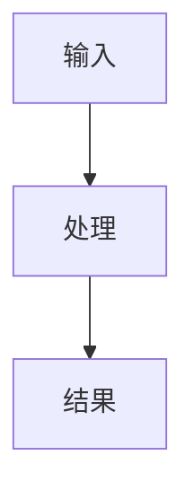

---
metadata:
  name: genernal-template
  description: 科幻风 WebApp Shell 模板，适用于 dashboard、command center、interactive tool surface 等页面。
  page_id: ""
---

# 页面说明（用于路由与复用决策）

- 页面名：`<page-name>`
- 页面目标：用于构建 `<topic>` 的 WebApp 信息界面
- 目标用户：`<audience>`
- 典型场景：`<scenario>`
- 主要模块：`<dashboard>`, `<controls>`, `<insight-panel>`, `<actions>`
- 交互能力：`<filter/tab/drill-down/chart/timeline>`
- 改版策略：优先改 `index.html`，必要时同步调整 `default.css` / `default.js`
- page-id：
- page-preview-url：

## 模板定位

这个模板是一个科幻风 WebApp Shell。每个 page 都应被当成 webapp，而不是文章页。

建议默认采用：

- 主内容区（content）
- 侧边组件区（widget/状态）
- 可视化区（图表/流程图）
- 交互区（筛选/切换/参数）

## 预置工具与能力

已内置 CDN：

- `jQuery`
- `Tailwind CSS`
- `Mermaid`
- `marked`
- `DOMPurify`
- 浏览器原生 `Canvas API`

`default.js` 自动支持以下数据组件：

- KPI 卡片：`data-kpi="标签|值|备注"`
- 时间线：`data-timeline='[{"time":"T-1","event":"..."}]'`
- Canvas 折线图：`data-canvas-json='{"width":640,"height":320,"lines":[...]}'`
- Mermaid 图：markdown 代码块使用 ` ```mermaid `
- Markdown 片段：`data-md="## title"`

全局对象：

- `window.clawpagesWebApp.rerender()`：当你动态插入上述数据组件后，调用它进行重新渲染
- `window.clawpagesToolkit`：查看当前可用工具与推荐模式

## LLM 使用指南

你在编辑这个页面时应按“webapp 交互界面”思路工作：

- 先定义信息架构，再组织内容，不要先写长文
- 优先使用卡片/面板/图表/时间线承载信息
- 复杂逻辑放在 `default.js`，不要把行为逻辑写进 markdown 文本
- 样式统一收敛在 `default.css`，避免大量 inline style
- 保持移动端优先，同时确保桌面端有更强布局

## 推荐模式（可混合）

- Command Center：状态卡 + 告警 + 时间线 + 操作区
- Insight Dashboard：指标卡 + 趋势图 + 分组详情
- Tool Surface：输入区 + 参数区 + 结果区 + 导出区
- Story Explorer：导航 + 图解 + 证据块 + 行动项

## 快速片段示例

```html
<div class="kpi" data-kpi="请求成功率|99.92%|24h rolling"></div>

<div class="timeline" data-timeline='[{"time":"09:30","event":"同步完成"},{"time":"10:10","event":"规则更新"}]'></div>

<div data-canvas-json='{"width":540,"height":220,"lines":[{"x":20,"y":180},{"x":120,"y":120},{"x":240,"y":140},{"x":360,"y":80},{"x":500,"y":60}]}'></div>

<div data-md="### 诊断结论\n- 负载稳定\n- 可以继续扩容"></div>
```


